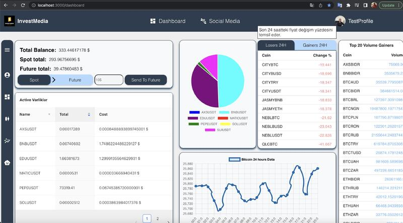

# 🚀 Market Analysis and Investment Bot Project

<div align="center">


</div>

A comprehensive cryptocurrency trading and investment platform that combines automated trading, machine learning predictions, and social media features for crypto enthusiasts.

## 📋 Table of Contents
- [Features](#features)
- [User Interface](#user-interface)
- [Technology Stack](#technology-stack)
- [Project Structure](#project-structure)
- [Prerequisites](#prerequisites)
- [Installation](#installation)
- [Configuration](#configuration)
- [Usage](#usage)
- [API Endpoints](#api-endpoints)
- [Contributing](#contributing)
- [License](#license)

## ✨ Features

### 🤖 Automated Trading Bot
- **Real-time Trading**: Automated buy/sell operations on Binance
- **EMA Strategy**: Uses 89-period Exponential Moving Average for trading decisions
- **Risk Management**: Configurable position sizing and stop-loss mechanisms
- **24/7 Monitoring**: Continuous market monitoring and execution

### 🧠 Machine Learning Predictions
- **Price Prediction**: K-Nearest Neighbors algorithm for next-close price prediction
- **Technical Analysis**: Integrated with multiple technical indicators
- **Historical Data**: Utilizes 1500+ data points for accurate predictions
- **Real-time Updates**: Live prediction updates based on market movements

### 👥 Social Trading Platform
- **User Profiles**: Create and customize trading profiles
- **Follow Traders**: Follow successful traders and copy their strategies
- **Investment Sharing**: Share your trading decisions and insights
- **Community Feed**: Real-time feed of trading activities and discussions

### 📊 Portfolio Management
- **Real-time Balance**: Live portfolio tracking across spot and futures
- **P&L Analysis**: Detailed profit/loss calculations
- **Position Monitoring**: Track open positions and their performance
- **Historical Reports**: Comprehensive trading history and analytics

### 📈 Market Analysis
- **Price Charts**: Interactive candlestick charts with technical indicators
- **Market Data**: Real-time price feeds and market statistics
- **Top Gainers/Losers**: Track best and worst performing cryptocurrencies
- **Volume Analysis**: Monitor trading volumes and market trends

## 🎨 User Interface

### Main Page
The platform features a modern and user-friendly interface. The impressive design that welcomes users on the main page:



*Market Analysis & Investment Bot platform's main page - Professional interface specially designed for cryptocurrency trading and investment management*

### Features
- **Modern Design**: Responsive and mobile-friendly interface
- **Easy Navigation**: Intuitive menu structure and user experience
- **Real-time Data**: Live charts and market data
- **Secure Login**: JWT-based secure authentication system
- **Multi-language Support**: Turkish and English language options

## 🛠️ Technology Stack

### Backend
- **Java Spring Boot 2.6.3**: Main API server with JWT authentication
- **Python Flask**: Trading bot and ML prediction engine
- **PostgreSQL**: Primary database for user data and trading history
- **Binance API**: Cryptocurrency exchange integration

### Frontend
- **React 18.2.0**: Modern, responsive user interface
- **Material-UI & Ant Design**: Beautiful UI components
- **Chart.js & Recharts**: Interactive trading charts
- **Axios**: HTTP client for API communication

### Machine Learning
- **scikit-learn**: K-Nearest Neighbors for price prediction
- **pandas**: Data manipulation and analysis
- **Technical Analysis Library (ta)**: Technical indicators calculation

## 📁 Project Structure

```
market-analysis-and-investment-bot-project/
├── src/main/java/com/example/senior/          # Java Spring Boot Backend
│   ├── controller/                            # REST API Controllers
│   │   ├── UserController.java               # User management
│   │   ├── BinanceController.java            # Binance integration
│   │   ├── BotController.java                # Trading bot control
│   │   ├── AnalysisController.java           # Market analysis
│   │   └── ...
│   ├── entity/                               # JPA Entities
│   │   ├── UsersEntity.java                  # User data model
│   │   ├── BinanceEntity.java                # Binance credentials
│   │   ├── PostEntity.java                   # Social media posts
│   │   └── ...
│   ├── service/                              # Business logic
│   ├── repository/                           # Data access layer
│   └── security/                             # JWT security config
├── frontend/                                 # React Frontend
│   ├── src/
│   │   ├── page/                            # Main application pages
│   │   │   ├── dashboard/                   # Trading dashboard
│   │   │   ├── charts/                      # Chart analysis
│   │   │   ├── social-media/                # Social trading
│   │   │   ├── invest-bot/                  # Bot management
│   │   │   └── analysis/                    # Market analysis
│   │   ├── component/                       # Reusable components
│   │   │   ├── header/                      # Navigation header
│   │   │   ├── binanceModal/                # Binance API setup
│   │   │   └── ...
│   │   └── App.js                           # Main application component
├── flask/                                   # Python Flask Backend
│   ├── app.py                              # Main Flask application
│   ├── bot.py                              # Trading bot implementation
│   ├── ModelingWithMl.py                   # ML prediction models
│   ├── config.py                           # Configuration settings
│   └── test.py                             # Testing utilities
└── pom.xml                                 # Maven dependencies
```

## 🔧 Prerequisites

Before running this project, make sure you have the following installed:

- **Java 17+**: For Spring Boot backend
- **Node.js 14+**: For React frontend
- **Python 3.8+**: For Flask backend and ML models
- **PostgreSQL 12+**: For database
- **Maven 3.6+**: For Java dependency management
- **Binance Account**: For trading functionality

## 📦 Installation

### 1. Clone the Repository
```bash
git clone https://github.com/hasanabbasov/market-analysis-and-investment-bot-project.git
cd market-analysis-and-investment-bot-project
```

### 2. Backend Setup (Java Spring Boot)
```bash
# Install Java dependencies
mvn clean install

# Run Spring Boot application
mvn spring-boot:run
```
The Java backend will start on `http://localhost:8080`

### 3. Frontend Setup (React)
```bash
cd frontend
npm install
npm start
```
The React frontend will start on `http://localhost:3000`

### 4. Python Flask Setup
```bash
cd flask
pip install -r requirements.txt
python app.py
```
The Flask backend will start on `http://localhost:5000`

### 5. Database Setup
```sql
-- Create PostgreSQL database
CREATE DATABASE market_analysis_db;

-- Update connection string in application.properties and config.py
-- Spring Boot: src/main/resources/application.properties
-- Flask: flask/config.py
```

## ⚙️ Configuration

### 1. Database Configuration
Update database credentials in:
- `src/main/resources/application.properties` (Spring Boot)
- `flask/config.py` (Flask)

### 2. Binance API Setup
1. Create a Binance account and generate API keys
2. Add your API keys through the application's Binance modal
3. Ensure API keys have futures trading permissions

### 3. Environment Variables
Create a `.env` file in the project root:
```env
DB_HOST=localhost
DB_PORT=5432
DB_NAME=market_analysis_db
DB_USER=your_username
DB_PASSWORD=your_password
JWT_SECRET=your_jwt_secret_key
```

## 🚀 Usage

### Starting the Trading Bot
1. Login to your account
2. Navigate to the "Investment Bot" page
3. Configure your trading parameters
4. Click "Start Bot" to begin automated trading

### Using Machine Learning Predictions
1. Go to the "Analysis" page
2. Select a cryptocurrency pair
3. View real-time predictions and historical accuracy
4. Use predictions to inform your trading decisions

### Social Trading
1. Create your trader profile
2. Follow other successful traders
3. Copy their trading strategies automatically
4. Share your own trading insights

### Portfolio Monitoring
1. Access the "Dashboard" for real-time portfolio overview
2. Monitor your positions, P&L, and trading history
3. View detailed charts and market analysis
4. Set up alerts for price movements

## 🔌 API Endpoints

### Spring Boot Backend (Port 8080)
- `POST /auth/login` - User authentication
- `POST /auth/register` - User registration
- `GET /user/profile` - Get user profile
- `POST /binance/save` - Save Binance API credentials
- `GET /bot/status` - Get trading bot status
- `POST /bot/start` - Start trading bot
- `POST /bot/stop` - Stop trading bot

### Flask Backend (Port 5000)
- `GET /futures_positions` - Get futures positions
- `GET /active_invest` - Get active investments
- `GET /btc_price_last_24_hours` - Get BTC price history
- `GET /top_change` - Get top gainers/losers
- `POST /buy` - Execute buy order
- `POST /sell` - Execute sell order
- `GET /predicted_close` - Get ML price predictions

## 🤝 Contributing

We welcome contributions! Please follow these steps:

1. Fork the repository
2. Create a feature branch (`git checkout -b feature/AmazingFeature`)
3. Commit your changes (`git commit -m 'Add some AmazingFeature'`)
4. Push to the branch (`git push origin feature/AmazingFeature`)
5. Open a Pull Request

### Development Guidelines
- Follow Java Spring Boot best practices
- Use React functional components with hooks
- Write clean, documented Python code
- Include unit tests for new features
- Update documentation for API changes

## 📄 License

This project is licensed under the MIT License - see the [LICENSE](LICENSE) file for details.

## ⚠️ Disclaimer

**IMPORTANT**: This software is for educational and research purposes only. Cryptocurrency trading involves substantial risk of loss. The developers are not responsible for any financial losses incurred through the use of this software. Always trade responsibly and never invest more than you can afford to lose.

## 🆘 Support

For support and questions:
- Create an issue on GitHub
- Check the documentation
- Review existing issues and discussions

## 🔮 Roadmap

- [ ] Advanced ML models (LSTM, Transformer)
- [ ] Mobile application
- [ ] Multiple exchange support
- [ ] Advanced portfolio analytics
- [ ] Backtesting capabilities
- [ ] Paper trading mode
- [ ] Advanced risk management tools
- [ ] Real-time notifications

---

**Happy Trading! 📈💰**
